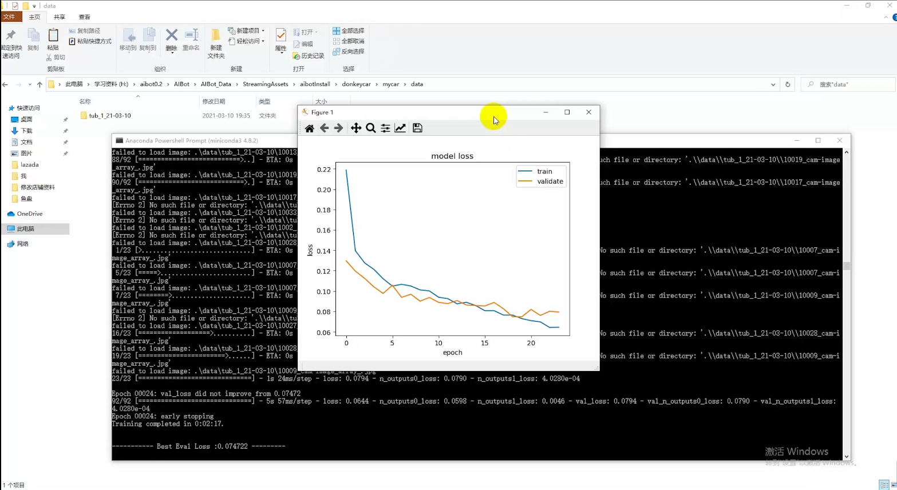

# 小车无人驾驶流程


## PC主机环境安装

Linux <http://docs.donkeycar.com/guide/host_pc/setup_ubuntu>

Windows <http://docs.donkeycar.com/guide/host_pc/setup_windows>

Mac <http://docs.donkeycar.com/guide/host_pc/setup_mac>


## 连接到小车

开启终端输入以下命令，远程连接到小车

```bash
ssh pi@192.168.20.237
```

密码为 `xmhw2015`


## 启动ROS节点

连接到小车后，输入以下命令启动`ros`节点

```bash
roslaunch linorobt donkeycar.launch
```


## 切换软件环境

开启另一个终端，输入以下命令切换到无人驾驶软件环境

```bash
source ~/env/bin/activate
```


## 启动无人驾驶训练

进入到`mycar`文件夹并启动小车无人驾驶训练

```bash
cd ~/mycar
python manage.py drive
```


## 开始训练

手机浏览器或者电脑浏览器输入地址，进入控制界面

```
http://192.168.20.237:8887
```


点击右边蓝色区域即可控制小车行走训练


## 训练数据模型

将小车内的数据（`~/mycar/data/tub-xxx-xxx`）传输到PC主机上，在PC主机上输入以下命令开始训练模型

```bash
python train --tub tub-xxx-xxx --model ./models/mypilot.h5
```

训练完成如下



## 导入模型

PC主机训练好模型后，导入到小车（`~/mycar/model`）

```bash
scp mypilot.h5 pi@192.168.20.237:/home/pi/mycar/model
```


## 开启自动驾驶模式

导入模型后，开启小车自动驾驶，输入以下命令

```bash
python manage.py drive --model ~/mycar/models/mypilot.h5
```

手机浏览器或者电脑浏览器输入地址，进入控制界面

```
http://192.168.20.237:8887
```

在控制界面上，`Mode & Pilot`选择`Local Pilot(d)`即可开始自动驾驶