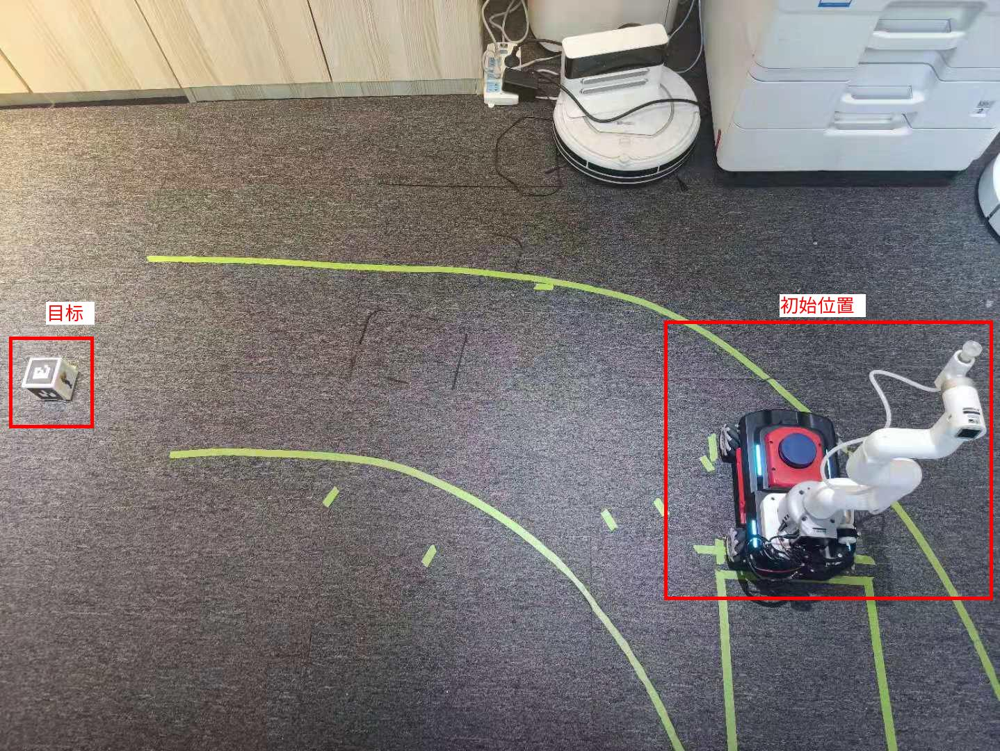
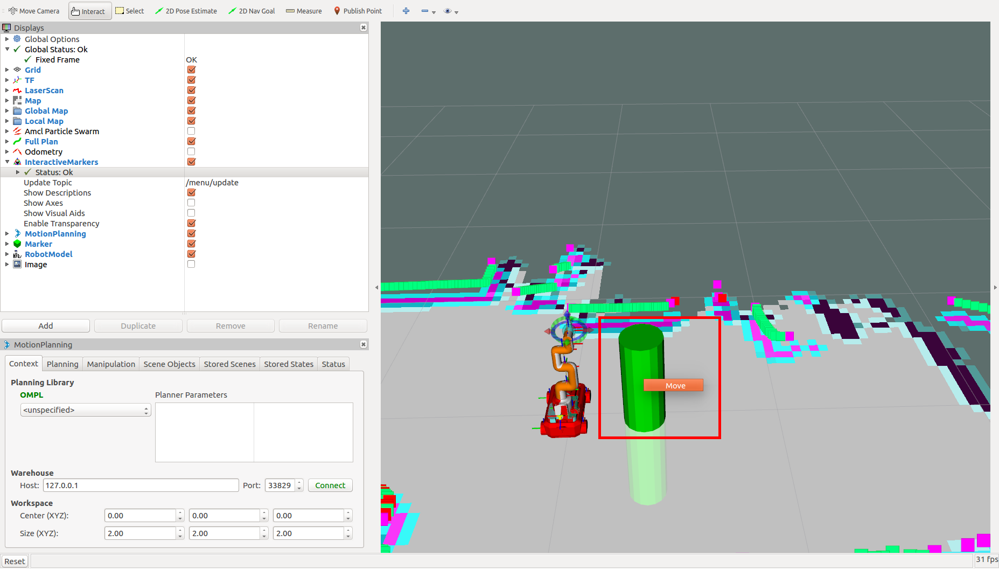

# 小车机械臂联动



小车机械臂联动示例包含以下几个步骤

* 小车导航
* 摄像头识别
* 机械臂吸取
* 返回初始位置
* 放下目标


## 启动主机示例节点

主机打开终端，输入以下命令启动示例节点
```bash
roslaunch arm_navigation aibot_arm_navigation_no_cam.launch
```

## 启动小车底盘

主机打开终端，输入以下命令连接小车并启动小车底盘

```bash
ssh pi@小车IP
roslaunch linorobot car_start.launch
```

## 启动小车摄像头识别和机械臂控制

主机打开终端，输入以下命令连接小车并启动摄像头识别和机械臂控制

```bash
ssh ubuntu@小车IP
roslaunch ros_arm_moveit arm_start.launch
```


## 运行示例代码

主机打开终端，输入以下命令运行示例
```bash
rosrun arm_navigation aibot_action_real
```

点击图标


移动绿色圆柱体后，鼠标右键圆柱体，点击`move`后，小车即开始自动运行

