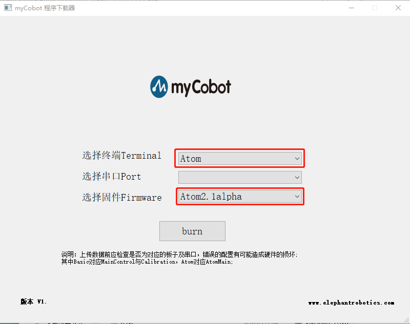
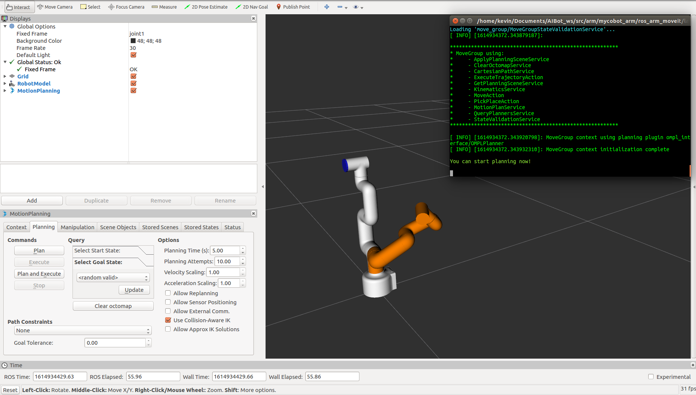

# 小车机械臂控制流程


## 机械臂固件烧录

解压`myCobot固件烧录器V1.2.zip`包到任意磁盘，将`USB`连接到机械臂底部的`type-c`接口，点击 `myCobot.exe` 运行，烧录版本如下，点击`burn`烧录即可

固件版本说明

* Basic Transponder
* Atom Atom2.1alpha

myCobot固件烧录器V1.2.zip  [windows下载](../source/myCobot固件烧录器V1.2.zip)


`base`烧录后，还需进行`Atom`烧录，将`USB`连接到机械臂末端的`type-c`接口，重新运行`myCobot.exe`，烧录版本如下，点击`burn`烧录即可。




## 远程连接到小车底盘

主机打开终端，输入以下命令，远程连接到**小车底盘**并启动`roscore`
```bash
ssh pi@小车ip
roscore
```


## 远程连接到机械臂

主机打开终端，输入以下命令，远程连接到**小车机械臂**并启动小车机械臂控制

```bash
ssh ubuntu@小车机械臂ip

roslaunch ros_arm_moveit arm_control.launch 
```

密码为`aibot1234`


## 启动机械臂控制包

主机打开终端，输入以下命令启动机械臂控制包

```bash
roslaunch ros_arm_moveit mycobot_arm_moveit.launch
```




机械臂控制启动后，在`rviz`上，点击`update`，随机生成机械臂动作，确定动作后，再点击`Plan and Execute`，机械臂即可执行相应动作。
