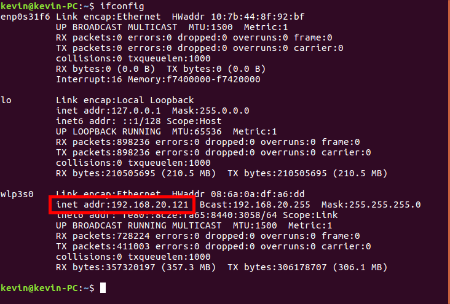

## 小车连接到本地WIFI网络

* PC连接本地WIFI网络并查看本地IP

    ```bash
    ifconfig
    ```

    如图所示，`ip`为`192.168.20.121`
    

* PC连接小车AP

    小车开机后，会生成一个AP，名称为`aibot_xxx`，PC主机连接到小车wifi，密码为`12345678`。

* SSH远程连接小车

    打开终端，使用`SSH`连接到小车系统，密码为`aibot1234`
    
    ```bash
    ssh pi@192.168.30.1
    ```

* 添加本地WIFI

    输入以下命令，编辑`wpa_supplicant.conf`文件
    
    ```bash
    sudo vim /etc/wpa_supplicant/wpa_supplicant.conf 
    ```

    添加本地`WIFI`信息到文件，如

    ```bash
    network={
        ssid="wifi名称"
        psk="wifi密码"
        key_mgmt=WPA-PSK
    }
    ```

    `ESC`退出，输入`:wq`保存

    输入以下命令，编辑`dhcpcd.conf`文件

    ```bash
    sudo vim /etc/dhcpcd.conf
    ```

    根据PC连接的网络信息，添加IP固定地址

    ```bash
    interface wlan0
    static ip_address=192.168.20.xxx/24
    static routers=192.168.20.1 
    static domain_name_servers=218.85.157.99
    ```
    >ip一般设置为200以外的网段比较不冲突，如`192.168.20.237`

    `ESC`退出，输入`:wq`保存


* 禁用AP

    ```bash
    sh ~/Documents/shcmd/disableAP.sh
    ```

* 重启小车

    终端输入

    ```bash
    sudo reboot
    ```