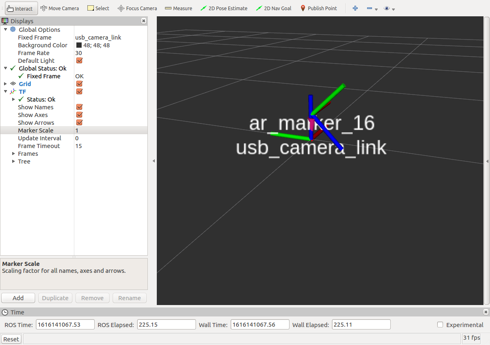
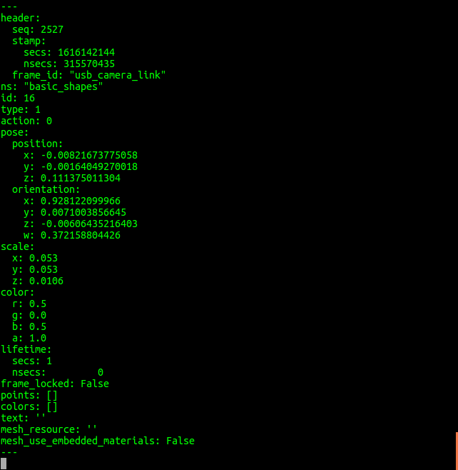

# 摄像头识别

## 摄像头标签

摄像头标签识别图片可到 http://wiki.ros.org/ar_track_alvar 下载


## 远程连接到小车底盘
主机打开终端，输入以下命令，远程连接到小车底盘并启动`roscore`

```bash
ssh pi@小车ip
roscore
```
密码为`aibot1234`


## 远程连接机械臂

主机打开终端，输入以下命令，远程连接到小车机械臂并启动摄像头识别节点

```bash
ssh ubuntu@小车机械臂ip
roslaunch arm_navigation aibot_arm_cam.launch 

```
密码为`aibot1234`


## 启动主机节点

主机打开终端，输入以下命令,打开可视化识别

```bash
roslaunch arm_navigation camera_ar.launch
```


## 放置标签

将标签放在摄像头可视范围内，可以看到标签被识别



## 查看识别信息

主机打开终端，输入以下命令查看识别信息

```bash
rostopic echo /visualization_marker
```

识别信息如图所示


