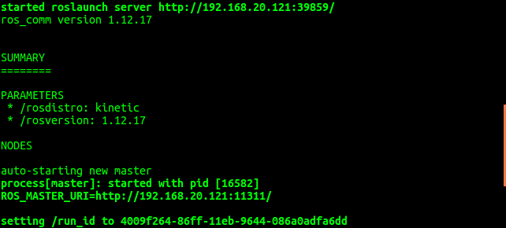

# ROS环境安装

* 系统：Ubuntu 16.04.5 LTS
* ROS：Kinetic Kame

[ros官网安装](http://wiki.ros.org/kinetic/Installation/Ubuntu)

## Ubuntu更换国内源

* 备份本地源

```bash
sudo mv /etc/apt/sources.list /etc/apt/sources.list.bk
```

* 编辑软件源，写入以下信息

```bash
sudo vim /etc/apt/sources.list
```

```bash
deb http://mirrors.aliyun.com/ubuntu/ xenial main
deb-src http://mirrors.aliyun.com/ubuntu/ xenial main
deb http://mirrors.aliyun.com/ubuntu/ xenial-updates main
deb-src http://mirrors.aliyun.com/ubuntu/ xenial-updates main
deb http://mirrors.aliyun.com/ubuntu/ xenial universe
deb-src http://mirrors.aliyun.com/ubuntu/ xenial universe
deb http://mirrors.aliyun.com/ubuntu/ xenial-updates universe
deb-src http://mirrors.aliyun.com/ubuntu/ xenial-updates universe
deb http://mirrors.aliyun.com/ubuntu/ xenial-security main
deb-src http://mirrors.aliyun.com/ubuntu/ xenial-security main
deb http://mirrors.aliyun.com/ubuntu/ xenial-security universe
deb-src http://mirrors.aliyun.com/ubuntu/ xenial-security universe
```


## 设置sources.list

```bash
sudo sh -c '. /etc/lsb-release && echo "deb http://mirrors.tuna.tsinghua.edu.cn/ros/ubuntu/ `lsb_release -cs` main" > /etc/apt/sources.list.d/ros-latest.list'
```

## 设置密钥

```bash
sudo apt-key adv --keyserver 'hkp://keyserver.ubuntu.com:80' --recv-key C1CF6E31E6BADE8868B172B4F42ED6FBAB17C654
```

## 安装

```bash
sudo apt-get update
sudo apt-get install ros-kinetic-desktop-full
```

## 初始化 rosdep

```bash
sudo rosdep init
rosdep update
```

> <font color=#FF000 >如果初始化失败，设置VPN重新初始化或者直接跳过该步骤</font>


## 环境配置

```bash
echo "source /opt/ros/kinetic/setup.bash" >> ~/.bashrc
source ~/.bashrc
```

## 构建工厂依赖

```bash
sudo apt-get install python-rosinstall python-rosinstall-generator python-wstool build-essential
```

## 验证

打开终端输入以下命令

```bash
roscore
```

如图所示，出现以下信息即安装成功




## 新建ROS工作空间

主机打开终端，输入以下命令新建ROS工作空间

```bash
mkdir -p catkin_ws/src
```

## 安装小车ROS依赖包

创建好工作空间文件夹后，输入以下命令下载ROS包

```bash
cd ~/catkin_ws/src
git clone https://github.com/kevin-zhuang/ros_arm_moveit
```

或者从[这里](../source/ros_arm_moveit.zip)下载

将下载的ROS包放在工作空间，输入以下命令编译

```bash
cd ~/catkin_ws
catkin_make
source devel/setup.bash
```

## 小车其他依赖安装

主机打开终端,在终端中输入以下命令安装依赖包
```bash
sudo apt-get install ros-kinetic-joint-state-controller ros-kinetic-joint-trajectory-controller ros-kinetic-controller-manager ros-kinetic-position-controllers ros-kinetic-moveit ros-kinetic-moveit-ros-move-group ros-kinetic-moveit-ros ros-kinetic-trac-ik-lib ros-kinetic-navigation ros-kinetic-gmapping ros-kinetic-teleop-twist-keyboard
```


