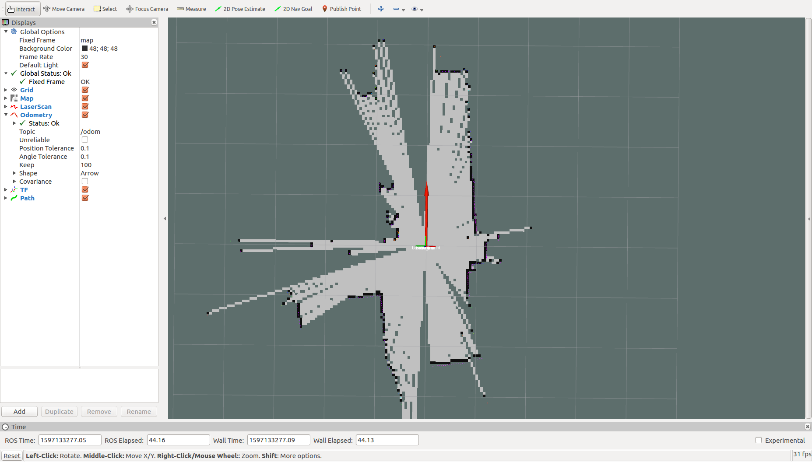
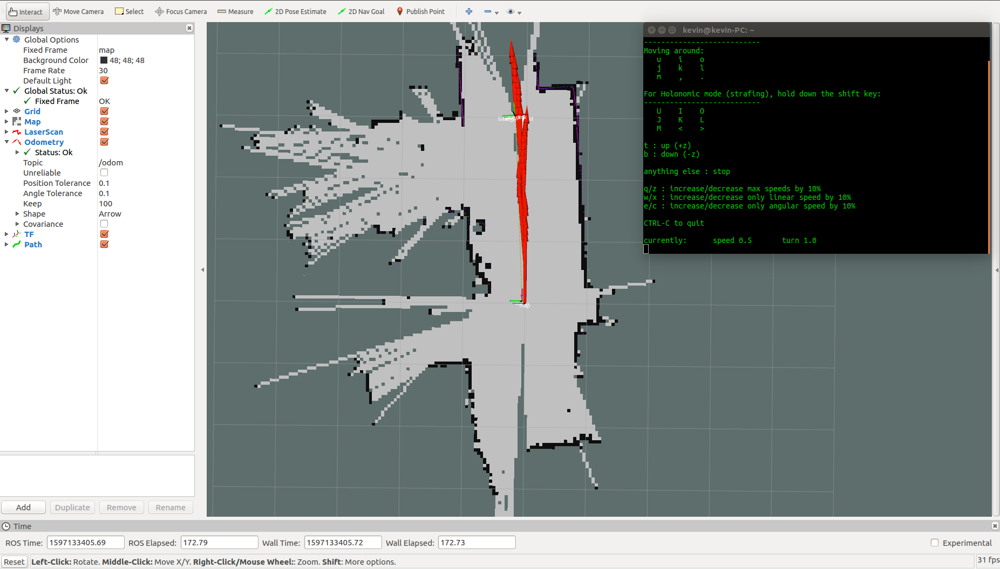
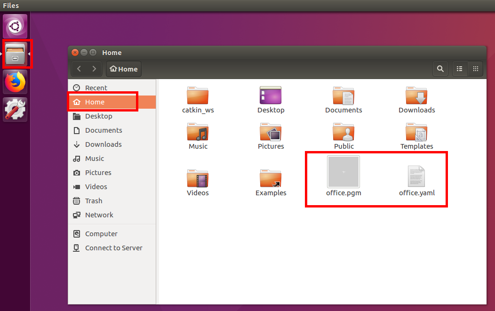

# 小车SLAM流程

## PC安装ROS

[ros ubuntu安装](ros_install.md)

## 小车连接到本地WIFI网络

[小车连接到本地WIFI网络设置](local_connect.md)

## 设置PC、小车主从机模式

[ros主从机设置](ros_master_ip.md)


## 建图

* 启动PC节点
    
    在PC端开启终端，输入以下内容，启动建图节点
    
    ```bash
    roslaunch navigation_demo slam.launch
    ```

* 远程连接**小车底盘**

    使用`SSH`连接到小车，密码为`aibot1234`

    ```bash
    ssh pi@192.168.20.237
    ```

    >根据实际情况，选择实际的IP地址，如果实际设置小车的IP地址为`192.168.1.251`，那么上面的`192.168.20.237`则改为`192.168.1.251`


* 启动小车节点

    ```bash
    roslaunch linorobot car_slam.launch
    ```

* 启动键盘控制

    在PC端开启终端，输入以下内容

    ```bash
    rosrun teleop_twist_keyboard teleop_twist_keyboard.py
    ```

    ```bash
   u    i    o
   j    k    l
   m    ,    .
   ...
   q/z : increase/decrease max speeds by 10%
   w/x : increase/decrease only linear speed by 10%
   e/c : increase/decrease only angular speed by 10%
    ```
    按照提示,降低控制的线速度(按键x)为0.2左右,角速度(按键c)为0.5左右.

    之后进行小车的控制（前进`i`,后退`，`,原地左转`j`,原地右转`l`）

    效果如下图
    

    

* 保存地图

    PC端打开一个终端,输入以下命令

    ```bash
    rosrun  map_server map_saver -f map_name
    ```
    >其中map_name为保存地图的名称

    保存后有2个文件,分别是 `.pgm`和`.yaml`文件.打开文件管理器即可看到.
    

    如果出现无法建图或者导航,可能是时间同步问题，可以参照[时间同步](ros_time.md)做相应处理.
