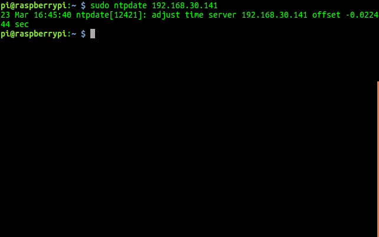

# 小车时间同步

## 主机软件安装

```bash
sudo apt-get install chrony
```

安装完成后编辑`chrony.conf`文件

```bash
sudo vim /etc/chrony/chrony.conf
```

在文件末尾添加以下内容

```bash
allow 小车IP/24 
```

添加完成后保存退出

## 小车时间同步

远程连接到小车(底盘/机械臂)
```bash
ssh pi@小车IP
```
或者
```bash
ssh ubuntu@小车IP
```

编辑`chrony.conf`文件，找到server关键字，修改成以下内容，如果没有，就手动添加

```bash
server 主机IP
```

添加完成后，保存退出

使用`ntpdate`命令同步主机时间

```bash
sudo ntpdate 主机IP
```

效果如图所示


