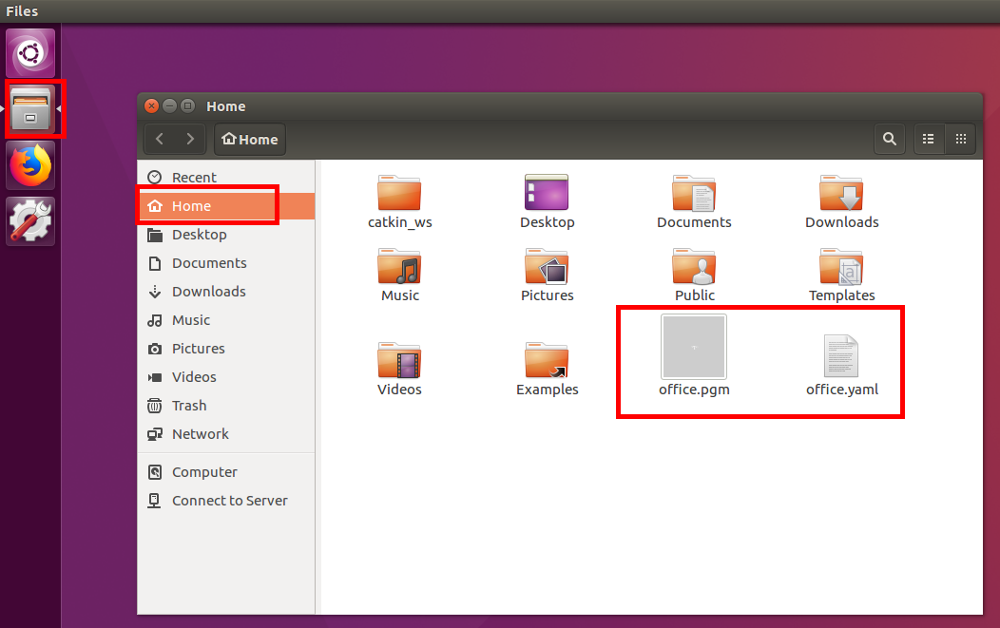
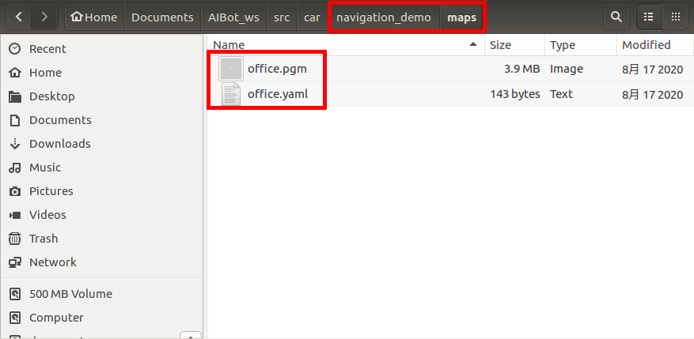
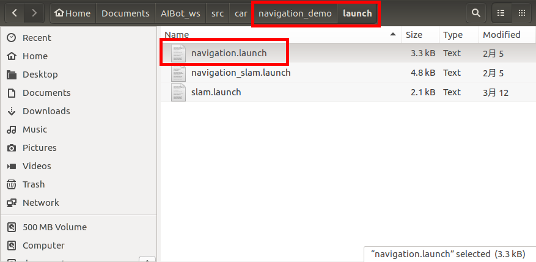
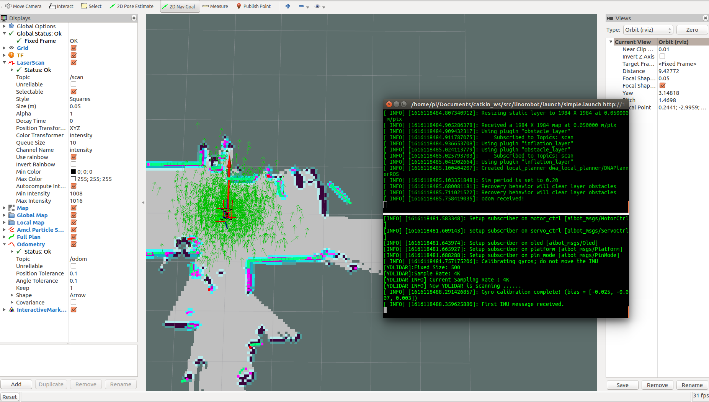
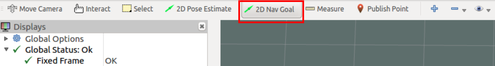
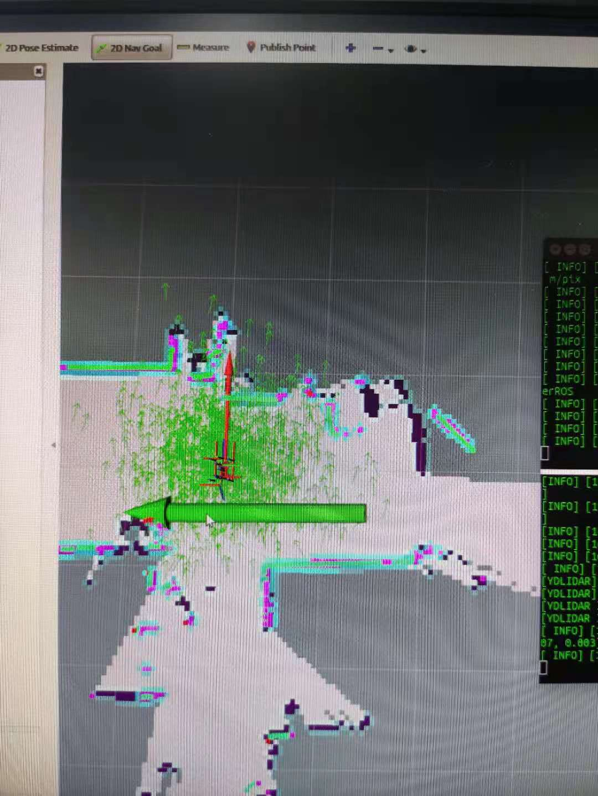
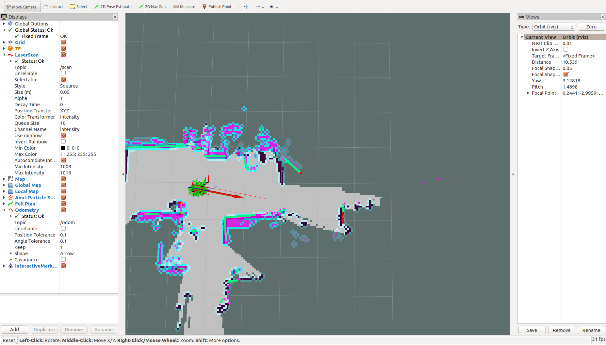
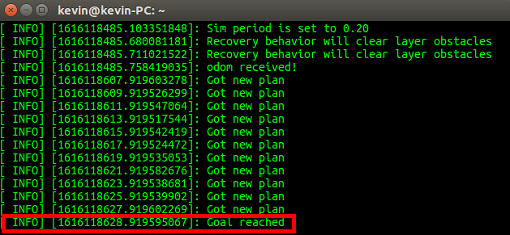

# 小车SLAM流程

## 检查是否连接到小车

主机打开终端,在终端中使用`ping`命令查看连接,输入以下命令并回车

```bash
ping 小车IP
```

退出命令`ctrl`+`c`,即同时输入`ctrl`键和`c`键

如果连接成功，类似效果如下


如果连接失败，类似效果如下


如果ping不通,检查主机或者虚拟机网络是否正常

## 建图

主机打开终端,使用SSH连接到 **小车底盘**

```bash
ssh pi@小车IP
```

输入密码 aibot1234,连接成功后,输入以下命令启动小车节点

```bash
roslaunch linorobot car_slam.launch
```

主机打开另一个终端,输入以下命令,启动建图节点

```bash
roslaunch navigation_demo slam.launch
```

主机再打开一个终端,输入以下命令,启动键盘控制节点

```bash
rosrun teleop_twist_keyboard teleop_twist_keyboard.py
```

```bash
   u    i    o
   j    k    l
   m    ,    .
   ...
   q/z : increase/decrease max speeds by 10%
   w/x : increase/decrease only linear speed by 10%
   e/c : increase/decrease only angular speed by 10%
```

按照提示,降低控制的线速度(按键x)为0.2左右,角速度(按键c)为0.5左右.

之后进行小车的控制（前进`i`,后退`，`,原地左转`j`,原地右转`l`）

效果如下图


如果需要保存地图,主机打开一个终端,输入以下命令

```bash
rosrun  map_server map_saver -f map_name
```
>其中map_name为保存地图的名称

保存后有2个文件,分别是 `.pgm`和`.yaml`文件.打开文件管理器即可看到.



如果出现无法建图或者导航,可能是时间同步问题，可以参照[时间同步](ros_time.md)做相应处理.


## 导航

将保存好的地图文件，放入`ros`工程下的`map`文件夹下



修改`launch/navigation`文件内的参数




找到该行

```xml
    <arg name="map_file" default="$(find navigation_demo)/maps/xxx.yaml"/>
```

修改地图文件信息

```xml
    <arg name="map_file" default="$(find navigation_demo)/maps/office.yaml"/>
```

保存文件


主机打开终端,使用SSH连接到**小车底盘**

```bash
ssh pi@小车IP
```

输入密码 aibot1234,连接成功后,输入以下命令启动小车节点

```bash
roslaunch linorobot car_slam.launch
```

主机打开另一个终端,输入以下命令,启动导航节点

```bash
roslaunch navigation_demo navigation.launch
```

启动完成后如图所示


点击选择导航按钮


在地图上选择导航目标点，按住鼠标左键不放，移动鼠标确定方向


放开鼠标后，小车开始导航


当出现`goal reached`时，说明导航结束，小车已经到达目标点

