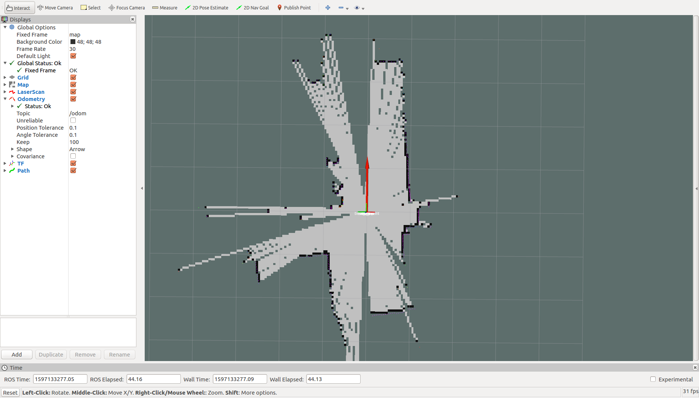
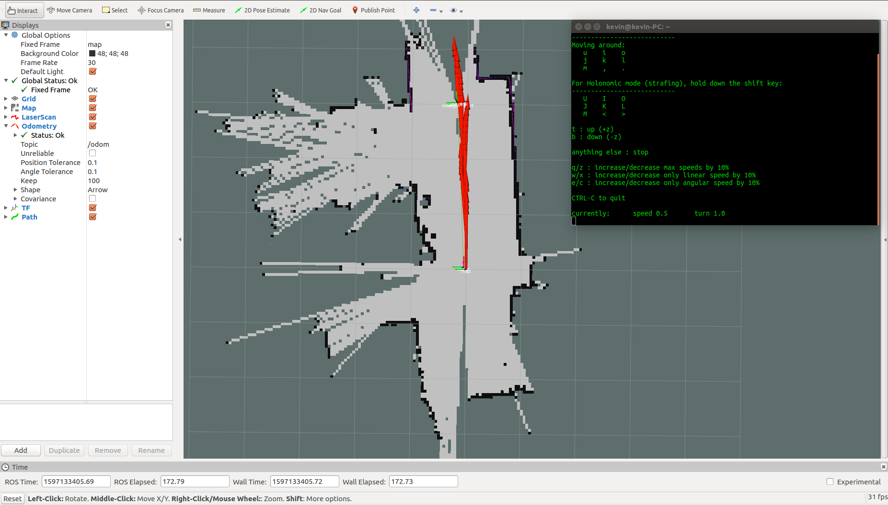

# 小车SLAM流程


## 导入虚拟机

虚拟机文件为ubuntu_16_04_5.ova,使用virtual box软件打开.

打开virtual box软件,点击File->Import Virtual Appliance,选择虚拟机文件ubuntu_16_04_5.ova,点击Import,导入虚拟机.

导入虚拟机后,还需要设置虚拟机网络,选择桥接模式,选择对应本机的网卡即可.
>可能还需要安装virtual box拓展包,直接去官网下载安装即可.


## 虚拟机设置

使用virtual box 打开ubuntu_16_04_5,网络设置改为桥接模式(分配IP)


## 启动小车

小车启动后,会生成一个AP热点(WIFI),名称为AIBot_xxx,主机网络连接到AIBot_xxx,密码12345678.

视频操作(ap_connect.mp4).

## 检查是否连接到小车

启动虚拟机后,打开终端,在终端中使用`ping`命令查看连接,输入以下命令并回车
```bash
ping 192.168.30.1
```
退出命令`ctrl`+`c`,即同时输入`ctrl`键和`c`键

如果连接成功，类似效果如下


如果连接失败，类似效果如下


如果ping不通,检查主机(不是虚拟机)有没有连接到aibot_xxx的wifi热点,如果已经连接aibot_xxx,再检查虚拟机是否设置桥接模式.


## 建图

具体操作可观看视频了解.视频文件在video文件夹下,建图视频为SLAM.mp4,导航视频为navigation.mp4.

打开虚拟机中的终端,使用SSH连接到小车

```bash
ssh pi@192.168.30.1
```
输入密码 xmhw2015,连接成功后,输入以下命令启动小车节点
```bash
roslaunch linorobot start.launch
```

打开另一个虚拟机终端,输入以下命令,启动建图节点(以建图为例)
```bash
roslaunch navigation_demo slam.launch
```


再打开一个终端,输入以下命令,启动键盘控制节点
```bash
rosrun teleop_twist_keyboard teleop_twist_keyboard.py
```
```bash
   u    i    o
   j    k    l
   m    ,    .
   ...
   q/z : increase/decrease max speeds by 10%
   w/x : increase/decrease only linear speed by 10%
   e/c : increase/decrease only angular speed by 10%
```
按照提示,降低控制的线速度(按键x)为0.2左右,角速度(按键c)为0.5左右.

之后进行小车的控制（前进`i`,后退`，`,原地左转`j`,原地右转`l`）

效果如下图




如果需要保存地图,打开一个终端,输入以下命令
```bash
rosrun  map_server map_saver -f map_name
```
>其中map_name为保存地图的名称

保存后有2个文件,分别是 `.pgm`和`.yaml`文件.打开文件管理器即可看到.


如果出现无法建图或者导航,可能是时间同步问题，可以参照视频time.mp4做相应处理.
